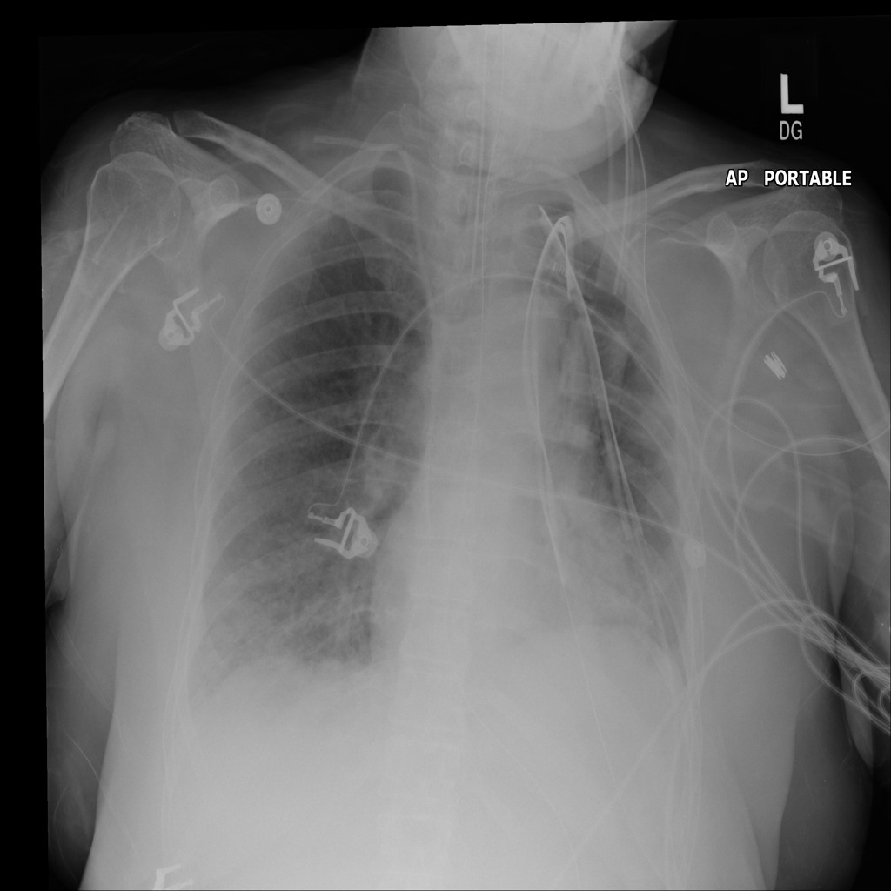

# Chest X-Ray Inference with Qwen2.5-VL-7B-Instruct

This project performs inference on chest x-ray images. The model used for inference is Qwen2.5-VL-7B-Instruct which is available through HuggingFace at https://huggingface.co/Qwen/Qwen2.5-VL-7B-Instruct

## Setup

You can create a conda environment with the provided environment.yaml file.

```
conda env create -f environment.yaml
conda activate vlm_env
```

The project contains two files and this README: (1) ```inference_Qwen.py```, the main runnable script for inference; (2) ```test_labels_dict.json```, a dictionary associating each file name with its label (positive or negative). Please download the chest x-ray dataset from Kaggle at  https://www.kaggle.com/datasets/andyczhao/covidx-cxr2 

## Project Strucutre

Make sure that the file structure for this project is:

```
project/
├── data/
│   └── test/
├── inference_Qwen.py
├── test_labels_dict.json
└── README.md
```

The test/ folder must contain the chest x-ray images, and test_labels_dict.json must be in the root folder. The test_labels_dict.json file must contain a dictionary like:
```
{"MIDRC-RICORD-1C-419639-003251-46647-0.png": "positive",
"MIDRC-RICORD-1C-419639-001464-39871-0.png": "positive",
"MIDRC-RICORD-1C-419639-000918-78965-0.png": "positive",
"MIDRC-RICORD-1C-419639-003318-64285-0.png": "positive", }
```
## Running Inference 
To run inference 
```
python inference_Qwen.py
```

Running inference outputs a file ```Qwen_outputs.py``` containing descriptions of chest x-rays. 

Inputs are images like 



and the output in ```Qwen_outputs.json``` will include and entry like:

```
"sub-S05368_ses-E10010_run-1_bp-chest_vp-pa_dx-corrected.png": {
    "text": "This is a posterior-anterior (PA) view of a chest x-ray. Here's a detailed description and analysis:\n\n1. **Lungs:**\n   - The lung fields appear relatively clear without any obvious signs of consolidation, pleural effusion, or masses.\n   - The lung markings are visible but not particularly prominent, which could be due to the patient's age or underlying lung condition.\n\n2. **Heart:**\n   - The heart size appears within normal limits for this view.\n   - There are no obvious signs of cardiomegaly or pericardial effusion.\n\n3. **Bones:**\n   -",
    "true_label": "negative"
  },
  ```


## Notes
Note that currently, inference is running on GPU 0. Change this setting as necessary.
```
torch_dtype=torch.bfloat16,     ## "auto"
device_map={"":0}               ## "auto"
inputs = inputs.to("cuda:0")    ## inputs.to("cuda")
```

The number of processed images is currently limited in the line:
```
image_files_subset = image_files[:3]
```
